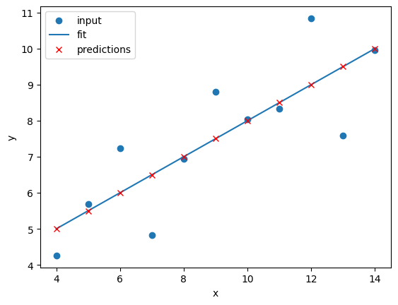
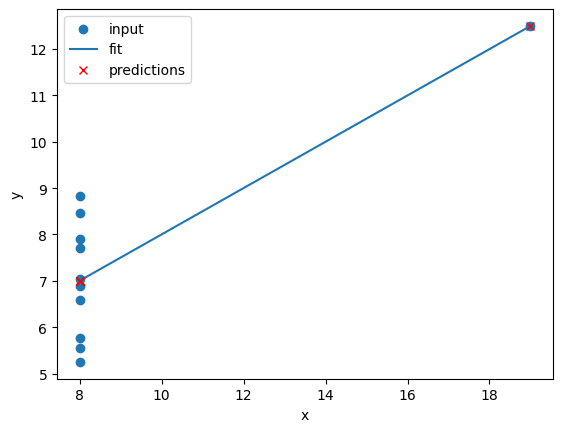
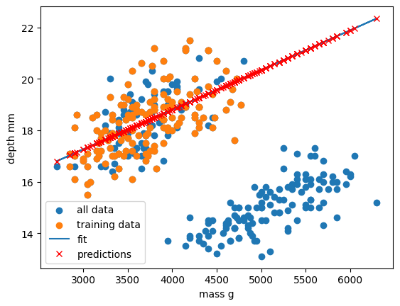

# Supervised learning

Classical machine learning is often divided into two categories – supervised and unsupervised learning. 

For the case of supervised learning we act as a "supervisor" or "teacher" for our ML algorithms by providing the algorithm with "labelled data" that contains example answers of what we wish the algorithm to achieve. 

For instance, if we wish to train our algorithm to distinguish between images of cats and dogs, we would provide our algorithm with images that have already been labelled as "cat" or "dog" so that it can learn from these examples. If we wished to train our algorithm to predict house prices over time we would provide our algorithm with example data of datetime values that are "labelled" with house prices.

Supervised learning is split up into two further categories: classification and regression. For classification the labelled data is discrete, such as the "cat" or "dog" example, whereas for regression the labelled data is continuous, such as the house price example.

In this episode we will explore how we can use regression to build a "model" that can be used to make predictions.

# Regression

Regression is a statistical technique that relates a dependent variable (a label in ML terms) to one or more independent variables. A regression model attempts to describe this relation by fitting the data as closely as possible according to mathematical criteria. This model can then be used to predict new labelled values by inputting the independent variables into it. For example, if we create a house price model we can then feed in any datetime value we wish, and get a new house price value prediction.

Regression can be as simple as drawing a "line of best fit" through data points, known as linear regression, or more complex models such as polynomial regression, and is used routinely around the world in both industry and research. You may have already used regression in the past without knowing that it is also considered a machine learning technique!

### Linear regression using Scikit-Learn

We've had a lot of theory so time to start some actual coding! Let's create regression models for a small bundle of datasets known as [Anscombe's Quartet](https://en.wikipedia.org/wiki/Anscombe%27s_quartet). These datasets are available through the Python plotting library [Seaborn](https://seaborn.pydata.org/). Let's define our bundle of datasets, extract out the first dataset, and inspect it's contents:

~~~
import seaborn as sns

# Anscomes Quartet consists of 4 sets of data
data = sns.load_dataset("anscombe")
print(data.head())

# Split out the 1st dataset from the total
data_1 = data[data["dataset"]=="I"]
data_1 = data_1.sort_values("x")

# Inspect the data
print(data_1.head())
~~~
{: .language-python}

We see that the dataset bundle has the 3 columns `dataset`, `x`, and `y`. We have already used the `dataset` column to extract out Dataset I ready for our regression task. Let's visually inspect the data:

~~~
import matplotlib.pyplot as plt

plt.scatter(data_1["x"], data_1["y"])
plt.xlabel("x")
plt.ylabel("y")
plt.show()
~~~
{: .language-python}

In this regression example we will create a Linear Regression model that will try to predict `y` values based upon `x` values.

In machine learning terminology: we will use our `x` feature (variable) and `y` labels("answers") to train our Linear Regression model to predict `y` values when provided with `x` values.

The mathematical equation for a linear fit is `y = mx + c` where `y` is our label data, `x` is our input feature(s), `m` represents the gradient of the linear fit, and `c` represents the intercept with the y-axis.

A typical ML workflow is as following:
* Define the model (also known as an estimator)
* Tweak your data into the required format for your model
* Train your model on the input data
* Predict some values using the trained model

We will be training a few Linear Regression models in this episode, so let's define a handy function to create our model, tweak our input data, train our model, inspect the trained model parameters `m` and `c`, make some predictions, and finally visualise our data.

~~~
import math
import numpy as np
from sklearn.metrics import mean_squared_error
from sklearn.linear_model import LinearRegression

def fit_a_linear_model(x, y):
    # Define our estimator/model
    model = LinearRegression(fit_intercept=True)

    # tweak our data to work with our estimator/model
    # sklearn requires a 2D array, so lets reshape our 1D arrays.
    x_data = np.array(x).reshape(-1, 1)
    y_data = np.array(y).reshape(-1, 1)

    # train our estimator/model using our data
    lin_regress = model.fit(x_data,y_data)

    # inspect the trained estimator/model parameters
    m = lin_regress.coef_
    c = lin_regress.intercept_
    print("linear coefs=",m, c)

    # predict some values using our trained estimator/model
    # (in this case we predict our input data!)
    linear_data = lin_regress.predict(x_data)

    # visualise!
    # Don't call .show() here so that we can add extra stuff to the figure later
    plt.plot(x_data, linear_data)
    plt.scatter(x_data, y_data)
    plt.xlabel("x")
    plt.ylabel("y")

    # calculated a RMS error as a quality of fit metric
    error = math.sqrt(mean_squared_error(y_data, linear_data))
    print("linear error=",error)

    # return our trained model so that we can use it later
    return lin_regress
~~~
{: .language-python}

Now we have defined our generic function to fit a linear regression we can call the function to train it on some data, and show the plot that was generated:
~~~
# just call the function here rather than assign.
# We don't need to reuse the trained model yet
fit_a_linear_model(data_1["x"],data_1["y"])

plt.show()
~~~
{: .language-python}

This looks like a reasonable linear fit to our first dataset. Thanks to our function we can quickly perform more linear regressions on other datasets.

> ### Exercise: Repeat the linear regression excercise for Datasets II, III, and IV. What can you say about the similarities and/or differences between the linear regressions on the 4 datasets?
> > ### Solution
> ~~~
> > # Repeat the following for dataset 2, 3, and 4
> > data_2 = data[data["dataset"]=="II"]
> > data_2 = data_2.sort_values("x")
> > 
> > fit_a_linear_model(data_2["x"],data_2["y"])
> > 
> > plt.show()
> > ~~~
> > {: .language-python}

> > 
> > 
> > 
> > The 4 datasets all produce very similar linear regression fit parameters (`m` and `c`) and RMSEs despite visual differences in the 4 datasets. 
> > 
> > This is intentional as the Anscombe Quartet is designed to produce near identical basic statistical values such as means and standard deviations. 
> > 
> > While the trained model parameters and errors are near identical, our visual inspection tells us that a linear fit might not be the best way of modelling some of these datasets.
> 
> {: .solution}
{: .challenge}

## Polynomial regression using Scikit-Learn

Now that we have learnt how to do a linear regression it's time look into polynomial regressions. Polynomial functions are non-linear functions that are commonly-used to model data. Mathematically they have `N` degrees of freedom and they take the following form `y = a + bx + cx^2 + dx^3 ... + mx^N`

If we have a polynomial of degree N=1 we once again return to a linear equation `y = a + bx` or as it is more commonly written `y = mx + c`. Let's create a polynomial regression using N=2. 

In Scikit-Learn this is done in two steps. First we pre-process our input data `x_data` into a polynomial representation using the `PolynomialFeatures` function. Then we can create our polynomial regressions using the `LinearRegression().fit()` function, but this time using the polynomial representation of our `x_data`.

~~~
from sklearn.preprocessing import PolynomialFeatures

def fit_a_poly_model(x,y):
    # Define our estimator/model(s)
    poly_features = PolynomialFeatures(degree=2)
    poly_regress = LinearRegression()

    # tweak our data to work with our estimator/model
    x_data = np.array(x).reshape(-1, 1)
    y_data = np.array(y).reshape(-1, 1)

    x_poly = poly_features.fit_transform(x_data)

    # define and train our model
    poly_regress.fit(x_poly,y_data)

    # inspect trained model parameters
    poly_m = poly_regress.coef_
    poly_c = poly_regress.intercept_
    print("poly_coefs",poly_m, poly_c)

    # predict some values using our trained estimator/model
    # (in this case - our input data)
    poly_data = poly_regress.predict(x_poly)

    # visualise!
    plt.plot(x_data, poly_data)

    poly_error = math.sqrt(mean_squared_error(y_data,poly_data))
    print("poly error=", poly_error)

    return poly_regress
~~~
{: .language-python}

Lets plot our original data, linear model, and polynomial model together as well as compare the errors of the linear and polynomial fits.

~~~
fit_a_linear_model(data_2["x"],data_2["y"])
fit_a_poly_model(data_2["x"],data_2["y"])

plt.show()
~~~
{: .language-python}

Comparing the plots and errors it seems like a polynomial regression of N=2 is a far superior fit to Dataset II than a linear fit. In fact, it looks like our polynomial fit almost perfectly fits Dataset II... which is because Dataset II is created from a N=2 polynomial equation!

> ### Exercise: Perform and compare linear and polynomial fits for Datasets I, III, and IV. 
> 1. Which performs better for each dataset?
> 2. Modify your polynomial regression function to take `N` as an input parameter to your regression model. How does changing the degree of polynomial fit affect each dataset?
{: .challenge}

## Let's explore a more realistic scenario

Now that we have some convenient Python functions to perform quick regressions on data it's time to explore a more realistic regression modelling scenario.

Let's start by loading in and examining a new dataset from Seaborn: a penguin dataset containing a few hundred samples and a number of features and labels.

~~~
dataset = sns.load_dataset("penguins")
dataset.head()
~~~
{: .language-python}

We can see that we have seven columns in total: 4 continuous (numerical) columns named `bill_length_mm`, `bill_depth_mm`, `flipper_length_mm`, and `body_mass_g`; and 3 discrete (categorical) columns named `species`, `island`, and `sex`. We can also see from a quick inspection of the first 5 samples that we have some missing data in the form of `NaN` values. Let's go ahead and remove any rows that contain `NaN` values:

~~~
dataset.dropna(inplace=True)
dataset.head()
~~~
{: .language-python}

Now that we have cleaned our data we try and predict a penguins bill depth using their body mass. In this scenario we will train a linear regression model using `body_mass_g` as our feature data and `bill_depth_mm` as our label data. We will train our model on a subset of the data by slicing the first 146 samples of our cleaned data. As before, we'll then use our regression function to train and plot our model.

~~~
dataset_1 = dataset[:146]

x_data = dataset_1["body_mass_g"]
y_data = dataset_1["bill_depth_mm"]

import matplotlib.pyplot as plt

trained_model = fit_a_linear_model(x_data, y_data)

plt.xlabel("mass g")
plt.ylabel("depth mm")
plt.show()
~~~

Congratulations! We've taken our linear regression function and quickly created and trained a new linear regression model on a brand new dataset. Note that this time we have returned our model from the regression function and assigned it to the variable `trained_model`. We can now use this model to predict `bill_depth_mm` values for any given `body_mass_g` values that we pass it.

Let's provide the model with all of the penguin samples and visually inspect how the linear regression model performs.
~~~
x_data_all = dataset["body_mass_g"]
y_data_all = dataset["bill_depth_mm"]

x_data_all = np.array(x_data_all).reshape(-1,1)

y_predictions = trained_model.predict(x_data_all)

error = math.sqrt(mean_squared_error(y_data_all, y_predictions))
print("penguin error=",error)

plt.scatter(x_data_all, y_data_all)
plt.scatter(x_data, y_data)

plt.plot(x_data_all, y_predictions)
plt.xlabel("mass g")
plt.ylabel("depth mm")
plt.show()
~~~

{: .language-python}

Oh dear. It looks like our linear regression fits okay for our subset of the penguin data, and a few additional samples, but there appears to be a cluster of points that are poorly predicted by our model.

This is a classic Machine Learning scenario known as over-fitting. We have trained our model on a specific set of data that isn't representitive of all the data we wish to predict and our model has become too specific to solve our general problem.

Remember: *Garbage in, Garbage out* and *correlation does not equal causation*. Just because almost every winner in the olympic games drank water, it doesn't mean that drinking heaps of water will make you an olympic winner.

