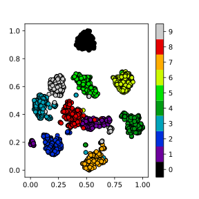
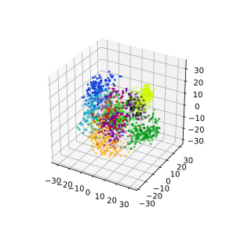
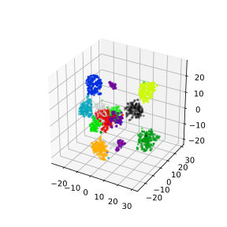

# Dimensionality Reduction (Changed)

As seen in the last episode, general clustering algorithms work well with low-dimensional data. In this episode we will work with higher-dimension data. Let's say you want to cluster handwritten numeric images? The dataset we will be using is the Modified National Institute of Standards and Technology database (MNIST). The MNIST dataset contains 60,000 handwritten labelled images from 0-9. An illustration of the dataset is presented below. 

To code to retrieve the entire dataset with Scikit-learn is given below,

~~~
import numpy as np
import matplotlib.pyplot as plt

from sklearn import decomposition
from sklearn import datasets
from sklearn import manifold

digits = datasets.load_digits()

# Examine the dataset
print(digits.data)
print(digits.target)

X = digits.data
y = digits.target
~~~
{: .language-python}

Linear clustering approaches such as K-means would require all the images to be binned into a pre-determined number of clusters, which might not adequately capture the variability in the images. 

Non-linear spectral clustering might fare better but, it would require the images to be projected into a higher dimension space and seperation of the complex projections in higher-order spaces would necessitate complex non-linear seperators.

Utilizing a 2D vector space and by reducing the dimension of the input dataset while preserving their local representations transforms the high-dimension input dataset into lower-order projections. These, lower-order projections can be easily seperated using linear seperators while preserving the variability of images within the dataset.

## Dimensionality Reduction with Scikit-learn
We will look at two commonly used techniques for dimensionality reduction, Principal Component Analysis (PCA) and t-distributed Stochastic Neighbor Embedding (t-SNE) both of which are supported by Scikit-learn.

### Principal Component Analysis (PCA)
PCA is an important technique for visualizing high-dimensional data. PCA is a deterministic linear technique which projects n-dimensional data into k-dimensions while preserving the global structure of the input data. Dimension reduction in PCA involves transforming highly-correlated data by rotating the original set of vectors into its principal components. The variance between the transformation can be inferred by computing their eigen values. 

The process of reducing dimensionality in PCA is as follows,
1. calculate the mean of each column
2. center the value in each column by subtracting the mean column value
3. calculate covariance matrix of centered matrix
4. calculate eigendecomposition of the covariance (eigenvectors represent the magnitude of directions or components for the reduce subspace)

Minimizing the eigen values closer to zero implies that the dataset has been successfully decomposed into their respective principal components. 

Utilizing scikit-learn makes applying PCA very easy. Lets code and apply PCA to the MNIST dataset. 

~~~
# PCA
pca = decomposition.PCA(n_components=2)
pca.fit(X)
X_pca = pca.transform(X)

fig = plt.figure(1, figsize=(4, 4))
plt.clf()
tx = X_pca[:, 0]
tx = (tx-np.min(tx)) / (np.max(tx) - np.min(tx))

ty = X_pca[:, 1]
ty = (ty-np.min(ty)) / (np.max(ty) - np.min(ty))

plt.scatter(tx, ty, c=y, cmap=plt.cm.nipy_spectral, 
        edgecolor='k',label=y)
plt.colorbar(boundaries=np.arange(11)-0.5).set_ticks(np.arange(10))
plt.savefig("pca.svg")
~~~
{: .language-python}

As illustrated in the figure above, PCA does not handle outlier data well (primarily due to global preservation of structural information) and has some of the same drawbacks of pre-determining the principal components as K-means clutering approaches. 

### t-distributed Stochastic Neighbor Embedding (t-SNE)
t-SNE is a non-deterministic non-linear technique which involves several optional Hyperparameters such as perplexity, learning rate and number of steps. While the t-SNE algorithm is complex to explain, it works on the principle of preserving local similarities by minimizing the pairwise gaussian distance between two or more points in high-dimensional space. The versatility of the algorithm in transforming the underlying structural information into lower-order projections makes t-SNE applicable to a wide range of research domains.

Utilizing scikit-learn makes applying t-SNE very easy. Lets code and apply t-SNE to the MNIST dataset.

~~~
# t-SNE embedding
tsne = manifold.TSNE(n_components=2, init='pca', random_state = 0)
X_tsne = tsne.fit_transform(X)
fig = plt.figure(1, figsize=(4, 4))
plt.clf()
plt.scatter(X_tsne[:, 0], X_tsne[:, 1], c=y, cmap=plt.cm.nipy_spectral,
        edgecolor='k',label=y)
plt.colorbar(boundaries=np.arange(11)-0.5).set_ticks(np.arange(10))
plt.savefig("tsne.svg")
~~~
{: .language-python}

The major drawback of applying t-SNE to datasets is it's large computational requirements. Furthermore, Hyperparameter tuning of t-SNE usually requires some trial-and-error to perfect. In the above figure, the algorithm still has trouble in seperating all the classes perfectly. To account for even higher-order input data, neural networks were developed to more accurately extract feature information.

> ## Exercise: Working in three dimensions
> The above example has considered only two dimensions since humans
> can visualize two dimensions very well. However, there can be cases
> where a dataset requires more than two dimensions to be appropriately
> decomposed. Modify the above programs to use three dimensions and 
> create appropriate plots.
> Do three dimensions allow one to better distinguish between the digits?
>
> > ## Solution
> > ~~~
> > from mpl_toolkits.mplot3d import Axes3D
> > # PCA
> > pca = decomposition.PCA(n_components=3)
> > pca.fit(X)
> > X_pca = pca.transform(X)
> > fig = plt.figure(1, figsize=(4, 4))
> > plt.clf()
> > ax = fig.add_subplot(projection='3d')
> > ax.scatter(X_pca[:, 0], X_pca[:, 1], X_pca[:, 2], c=y,
> >           cmap=plt.cm.nipy_spectral, s=9, lw=0)
> > plt.savefig("pca_3d.svg")
> > ~~~
> > {: .language-python}
> >
> > 
> >
> > ~~~
> > # t-SNE embedding
> > tsne = manifold.TSNE(n_components=3, init='pca',
> >         random_state = 0)
> > X_tsne = tsne.fit_transform(X)
> > fig = plt.figure(1, figsize=(4, 4))
> > plt.clf()
> > ax = fig.add_subplot(projection='3d')
> > ax.scatter(X_tsne[:, 0], X_tsne[:, 1], X_tsne[:, 2], c=y,
> >           cmap=plt.cm.nipy_spectral, s=9, lw=0)
> > plt.savefig("tsne_3d.svg")
> > ~~~
> > {: .language-python}
> >
> > 
> >
> >
> {: .solution}
{: .challenge}

> ## Exercise: Parameters
>
> Look up parameters that can be changed in PCA and t-SNE,
> and experiment with these. How do they change your resulting
> plots?  Might the choice of parameters lead you to make different
> conclusions about your data?
{: .challenge}

> ## Exercise: Other Algorithms
>
> There are other algorithms that can be used for doing dimensionality
> reduction, for example the Higher Order Singular Value Decomposition (HOSVD)
> Do an internet search for some of these and
> examine the example data that they are used on. Are there cases where they do 
> poorly? What level of care might you need to use before applying such methods
> for automation in critical scenarios?  What about for interactive data 
> exploration?
{: .challenge}



